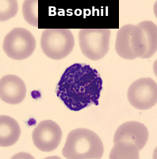
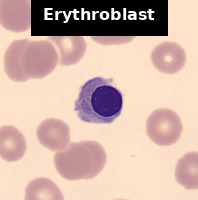
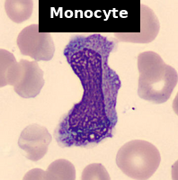
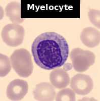
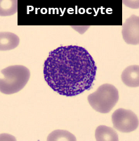

# Hematology Image Classification 🩸🔬 (Helmholtz HIDA Challenge 2022)

[](https://github.com/harefi/Hematology-Challenge-HIDA/actions)
[](https://www.python.org)
[](LICENSE)
[](docs/certificate.pdf)

> **Project Goal:** Show a complete, reproducible pipeline for classifying blood-cell images. This is meant as a portfolio example, not to win the original challenge.

# Hematology Image Classification (Helmholtz HIDA Challenge 2022)

Below is one sample image for each of the 11 blood-cell classes:

<div align="center">

<table>
  <tr>
    <td></td>
    <td></td>
    <td></td>
    <td></td>
    <td></td>
    <td></td>
  </tr>
  <tr>
    <td></td>
    <td></td>
    <td></td>
    <td></td>
    <td></td>
    <td></td>  <!-- empty cell to keep the 6×2 grid shape -->
  </tr>
</table>

<br/>

<strong>Figure 1</strong>: One sample image for each of the 11 blood‐cell classes.

</div>

[🔗 Official challenge page](https://www.helmholtz-hida.de/en/events/data-challenge-help-a-hematologist-out/)

---

## 🚀 30‑second Quick Start
```bash
# 1. Clone the repo and set up the environment
git clone https://github.com/harefi/Hematology-Challenge-HIDA.git
cd Hematology-Challenge-HIDA
conda env create -f environment.yml
conda activate hematol-22
# (or use: pip install -e .[dev] if you prefer pip)

# 2. Place the data archives in the Source/ folder
#    (Acevedo_20.zip and Matek_19.zip must be inside Source/)
#    The training script will unzip them automatically.

# 3. Train the baseline ResNet-18 model
make train

# 4. (Optional) Watch training curves
tensorboard --logdir results/*/tb --port 6006

```

After running `make train`, you will see a folder under `results/` named like `20250605_150210_baseline/`. Inside that folder are:
- `train.log` (console output)
- `training_log.csv` (epoch, loss, accuracy, F1)
- `best_model.pth` and `last_model.pth` (saved model files; not uploaded to GitHub)
- `tb/` (TensorBoard files)
- (No large model files are stored in the repo.)

---

## 📑 Table of Contents
1. [Background](#1-background)
2. [Data Download](#2-data-download)
3. [Environment](#3-environment)
4. [Repo Layout](#4-repo-layout)
5. [Exploratory Data Analysis (EDA)](#5-eda-highlights)
6. [Training Pipeline](#6-training-pipeline)
7. [Results & Analysis](#7-results-and-analysis)
8. [Next Steps](#8-road-map)
8. [How to Update This Repo](#9-update-repo)
9. [References](#10-references)

---

## 1  Background
This project uses two collections of blood‐cell images (about 33 000 total) that are labeled into 11 classes (different cell types). The official challenge server is not available anymore, so we create our own 80/20 split: 80 % of images for training and 20 % for validation.

Goals for this repo:

* Show clear code structure and automated tests (CI).
* Build a working __baseline__ model (ResNet-18).
* Run additional experiments and compare results.
* Explain how someone can reproduce and improve each step.

---

## 2  Data Download
Place the two original archives in `Source/`:
```
Source/
 ├─ Acevedo_20.zip
 └─ Matek_19.zip
```
When you run the training script, it will look for these ZIP files and unzip them into `Source/Acevedo_20/` and `Source/Matek_19/`. You do not need to unzip them yourself.

---

## 3  Environment
We use **Python 3.11** + CUDA 12. To set up, run:
```bash
conda env create -f environment.yml
conda activate hematol-22
# (Optional) To install dev tools:
pip install -e .[dev]
```
The main packages installed are:

* `torch` and `torchvision` (for neural networks)
* `numpy`, `pandas`, `scikit-learn`
* `matplotlib`, `tqdm`
* `black`, `ruff`, `pytest` (for code formatting and tests)

---

## 4  Repo Layout

```
hematology-challenge/
├── Source/                     # put data archives here (not tracked by Git)
├── data/                       # old data folder (no longer used)
│   └── README.md
├── docs/
│   └── certificate.pdf         # your challenge participation certificate
├── environment.yml             # Conda environment setup
├── Makefile                    # common commands (train, resume, etc.)
├── notebooks/
│   ├── 00_eda.ipynb            # exploratory data analysis
│   └── 01_starter_notebook.ipynb # original starter notebook from organizers
├── figures/                    #  sample thumbnails (one per blood-cell class)
├── results/                    # training output (git-ignored except plots/CSV)
├── scripts/
│   └── analyze_results.py      # script to make plots from results/
├── src/
│   └── hematol/
│       ├── data.py             # dataset loader and helper functions
│       ├── transforms.py       # image transforms (basic and strong)
│       ├── models.py           # builds ResNet-18 and EfficientNet-B0
│       └── train.py            # training script with CLI options
├── tests/
│   ├── test_data.py            # checks dataset code (skips if no data)
│   └── test_model.py           # checks that model code runs without error
├── .github/
│   └── workflows/
│       └── ci.yml              # GitHub Actions: black, ruff, pytest
├── .gitignore
├── .pre-commit-config.yaml     # settings for pre-commit
├── pyproject.toml              # project metadata & dependencies
└── README.md                   # this file
```
-   `Source/`: This folder is not in Git. It should hold the data ZIP files.
-   `results/`: Also not in Git (except for CSV and image plot files). Each experiment creates a timestamped subfolder here.

---

## 5  Exploratory Data Analysis (EDA)

Open `notebooks/00_eda.ipynb` to see how the data look:
*   We check class balance and image sizes.
*   We display sample images from each class.

Look for:
*   Some classes have fewer examples (up to ~8× fewer than the largest class).
*   Images come in various sizes, so we resize and crop to 224×224 in training.

---

## 6  Training Pipeline

Running `make train` (or `python -m src.hematol.train …`) does the following:

1. __Unzip__ any data archives in `Source/` (Acevedo_20.zip, Matek_19.zip).
2. __Build the dataset__ by merging both folders, reading labels from subfolder names.
3. __Create an 80/20 split__ (stratified by label).
4. __Assign transforms__:
    * __Basic__: Resize → RandomCrop → Flip → Rotate → Normalize.
    * __Strong__ (if `--strong_augment`): RandAugment → RandomErasing → Normalize.
5. __Choose model__:
    * By default, __ResNet-18__ (pretrained on ImageNet).
    * If `--model_name efficientnet_b0` is given, use __EfficientNet-B0__ instead.
6. __Choose loss__:
    * Standard cross-entropy by default.
    * If `--weighted_loss` is given, compute class weights to balance rare classes.
7. __Optimizer & scheduler__:
    * Uses __AdamW__ with base learning rate (default 1e-4).
    * If `--onecycle` is given, use __OneCycleLR schedule__.
8. __Mixed precision__:
    * If `--amp` is given, use `torch.cuda.amp` to speed up training.
9. __Training loop__:
    * For each epoch, run training and validation, logging loss, accuracy, and macro F1.
    * Save `best_model.pth` whenever validation F1 improves.
    * Save `last_model.pth` at the end of each epoch.
    * Write results to `training_log.csv` and to TensorBoard files under `tb/`.

To resume from a checkpoint, run:
```
make resume OUTDIR=results/baseline_20250601_123456 epochs=50
```

where `baseline_20250601_123456` is your existing results folder. The script will load `last_model.pth` and continue training.

---

## 7  Results & Analysis
We ran five different experiments. Below are the main findings.

### 7.1 Best Validation F1 Scores

| Experiment        | Flags                                           | Val Macro-F1 |
|-------------------|-------------------------------------------------|--------------|
| **baseline**      | *(default, ResNet-18)*                          | 0.89         |
| **weighted_loss** | `--weighted_loss`                               | 0.89         |
| **strong_augment**| `--strong_augment`                              | 0.87         |
| **b0**            | `--model_name efficientnet_b0`                  | 0.90         |
| **onecycle**      | `--model_name efficientnet_b0 --amp --onecycle` | 0.91         |

Below is a bar chart of those best F1 values:


What this means
* The plain ResNet-18 already reaches ~0.89 F1.
* Adding class weights (`--weighted_loss`) did not change F1 much; our classes are only moderately imbalanced.
* Very strong augmentation (`--strong_augment`) actually reduced F1 to ~0.87, suggesting that some extreme augmentations confuse cells that look similar.
* Switching to EfficientNet-B0 (`--model_name efficientnet_b0`) improves F1 to ~0.90.
* Finally, using mixed precision (`--amp`) + OneCycleLR (`--onecycle`) on EfficientNet-B0 further improves to ~0.91.

### 7.2  Baseline Confusion Matrix
Below is the confusion matrix for the __baseline ResNet-18__ on the validation set. Rows are the true labels; columns are the predicted labels.


Each cell shows how many images of a given true class (row) were predicted as each class (column). On the diagonal (where the row and column match), higher numbers mean the model is correctly classifying that cell type.

### Key observations:
* Most cell types (e.g., lymphocyte_typical, neutrophil_segmented, eosinophil) are nearly 100 % correct.
* The biggest confusions happen within the __myeloid lineage__ (immature white blood cells):
    - `lymphocyte_typical ↔ myeloblast` (39 images mixed up)
    - `metamyelocyte ↔ myeloblast` (39 images mixed up)
    - `myelocyte` also confused with `metamyelocyte` or `myeloblast`.
* Rare classes (basophil, erythroblast) have very few errors overall, but because their total counts are small, a few mistakes affect their F1 more.
* `neutrophil_banded` vs. `neutrophil_segmented` has some overlap (306 vs. 28 off-diagonals), since these shapes can look similar.

Overall, the baseline model already does a good job on most classes. Later improvements (EfficientNet and OneCycle+AMP) help reduce the remaining mistakes, especially among those hard-to-tell myeloid sub-types.

---

## 8 Next Steps

Based on what we saw, here are some ideas for future work:
### 1. Lineage-aware augmentations
Instead of very strong random augment, try milder transforms that preserve details for cells that look similar (e.g., myeloblast vs. metamyelocyte). That may reduce misclassifications within the same lineage.

### 2. Custom loss for similar classes
Use a hierarchical or “clustered” loss that penalizes mistakes across broad categories (e.g., misclassifying a lymphocyte as a neutrophil) more than mistakes within the myeloid lineage (e.g., myelocyte vs. myeloblast). This can guide the model to learn sub-category differences more carefully.

### 3. Ensemble of top models
Combine predictions from ResNet, EfficientNet, or other backbones (ConvNeXt, MobileNet, etc.). An ensemble often reduces errors by voting among models.

### 4. Self-supervised pre-training
Use the unlabeled images (if available) to pre-train a model with SimCLR/BYOL, then fine-tune on the 11 classes. This can help the network learn cell features without needing labels.

Feel free to open an issue or submit a pull request if you want to explore any of these ideas.

---

## 9 How to Update This Repo

### 1. Add new results
* If you run a new experiment (for example, a different backbone), create a new folder under `results/` (e.g., `20250606_153000_new_experiment/`).
* Make sure to save at least `training_log.csv`, a small plot (e.g., PNG), and summary CSV if you want to share metrics.
* __Do not__ commit large model files; keep models local or upload them somewhere else and link to them.

### 2. Update the README
* Edit the “Results & Analysis” section to add your new experiment name, flags used, and best validation F1.
* If you generate new plots (e.g., a new confusion matrix), save them under `results/` and embed them in the README in the same way.

### 3. Commit changes

```
git add README.md                 # after editing README
git add results/summary_f1.png     # if you added or updated the F1 bar chart
git add results/conf_matrix_baseline.png  # if you updated confusion matrix
git add results/results_summary.csv       # if you updated summary CSV
git commit -m "docs: update results with new experiments"
git push
```

### 4. Check CI
* Any changes to code should pass `black --check src/ tests/ scripts/`, `ruff check src/ tests/ scripts/`, and `pytest -q`.
* GitHub Actions will run these checks automatically when you open a pull request.

### 5. Merge to main
    
Once CI is green and the new results look correct, merge your changes into the `main` branch. That way, the public README and results display the latest experiments.

---

## 10  References
* [Helmholtz AI. *Data Challenge – Help a Hematologist Out* (2022).](https://www.helmholtz-hida.de/en/events/data-challenge-help-a-hematologist-out/)
* Matek, C., Schwarz, S., Spiekermann, K. et al. Human-level recognition of blast cells in acute myeloid leukaemia with convolutional neural networks. Nat Mach Intell 1, 538–544 (2019). https://doi.org/10.1038/s42256-019-0101-9
* Rupapara, V., Rustam, F., Aljedaani, W. et al. Blood cancer prediction using leukemia microarray gene data and hybrid logistic vector trees model. Sci Rep 12, 1000 (2022). https://doi.org/10.1038/s41598-022-04835-6
* Nazari E, Farzin AH, Aghemiri M, Avan A, Tara M, Tabesh H. Deep Learning for Acute Myeloid Leukemia Diagnosis. J Med Life. 2020 Jul-Sep;13(3):382-387. https://doi.org/10.25122/jml-2019-0090
*  Shaheen, Maneela, Khan, Rafiullah, Biswal, R. R., Ullah, Mohib, Khan, Atif, Uddin, M. Irfan, Zareei, Mahdi, Waheed, Abdul, Acute Myeloid Leukemia (AML) Detection Using AlexNet Model, Complexity, 2021, 6658192, 8 pages, 2021. https://doi.org/10.1155/2021/6658192 
